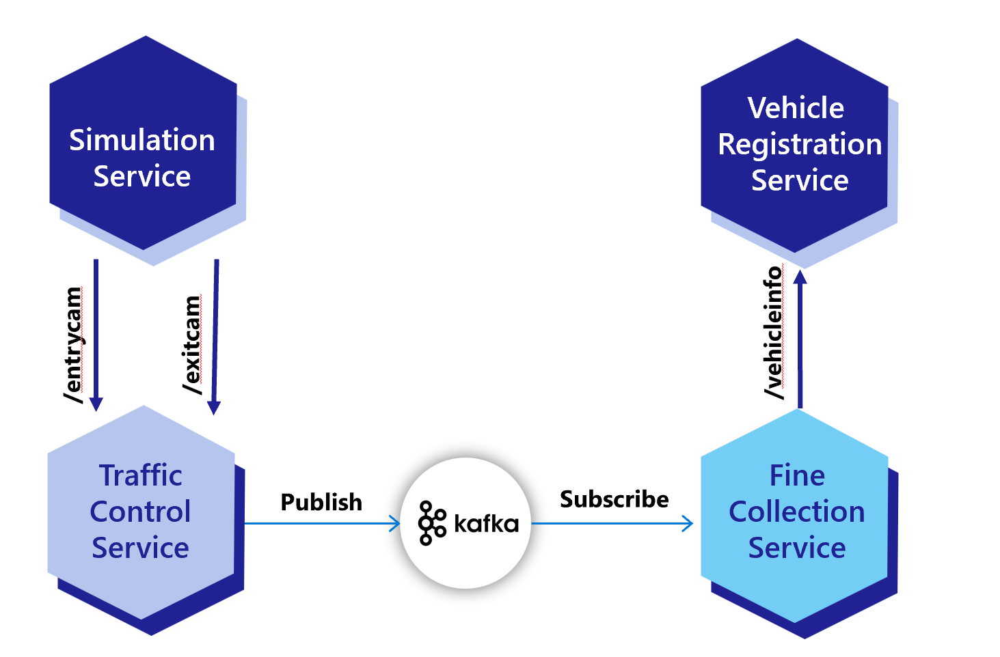

# Dapr Workshop for Pub/Sub and Observability in Java 

## Introduction

This workshop teaches you how to apply [Dapr](https://dapr.io) to a Java microservices application using Pub/Sub with Kafka.

### The domain

For the assignments you will be working with a speeding-camera setup as can be found on several Dutch highways. This is an overview of the fictitious setup you're simulating:


There's 1 entry-camera and 1 exit-camera per lane. When a car passes an entry-camera, the license-number of the car and the timestamp is registered.

When the car passes an exit-camera, this timestamp is also registered by the system. The system then calculates the average speed of the car based on the entry- and exit-timestamp. If a speeding violation is detected, a message is sent to the Central Fine Collection Agency (or CJIB in Dutch). They will retrieve the information of the owner of the vehicle and send him or her a fine.

### Architecture

In order to simulate this in code, the following services are defined:



1. The **Camera Simulation** generates a random license-number and sends a *VehicleRegistered* message (containing this license-number, a random entry-lane (1-3) and the timestamp) to the `/entrycam` endpoint of the TrafficControlService.
2. The **Traffic Control Service** stores the *VehicleState* (license-number and entry-timestamp).
3. After some random interval, the Camera Simulation sends a *VehicleRegistered* message to the `/exitcam` endpoint of the TrafficControlService (containing the license-number generated in step 1, a random exit-lane (1-3) and the exit timestamp).
4. The TrafficControlService retrieves the *VehicleState* that was stored at vehicle entry.
5. The TrafficControlService calculates the average speed of the vehicle using the entry- and exit-timestamp. It also stores the *VehicleState* with the exit timestamp for audit purposes, but this is left out of the sequence diagram for clarity.
6. If the average speed is above the speed-limit, the TrafficControlService publishes *SpeedingViolation* payload to kafka topic *test*. 
7. The FineCollectionService subscribes to kafka topic *test*.
8. The FineCollectionService calculates the fine for the speeding-violation.
9. The FineCollectionSerivice calls the `/vehicleinfo/{license-number}` endpoint of the VehicleRegistrationService with the license-number of the speeding vehicle to retrieve its vehicle- and owner-information.
10. The **Vehicle Registration Service** offers 1 HTTP endpoint: `/getvehicleinfo/{license-number}` for getting the vehicle- and owner-information of a vehicle.

### End-state with Dapr applied

After completing all the assignments, the architecture has been changed to work with Dapr and should look like this:


## Setup

### Prerequisites

Make sure you have the following prerequisites installed on your machine:

- Git ([download](https://git-scm.com/))
- Eclipse IDE for Java Developers ([download](https://www.eclipse.org/downloads/)
- Docker for desktop ([download](https://www.docker.com/products/docker-desktop)) or Rancher Desktop ([Download](https://rancherdesktop.io/))
- [Install the Dapr CLI](https://docs.dapr.io/getting-started/install-dapr-cli/) and [initialize Dapr locally](https://docs.dapr.io/getting-started/install-dapr-selfhost/)
- Java 16 or above ([download](https://adoptopenjdk.net/?variant=openjdk16))
- Apache Maven 3.6.3 or above is required; Apache Maven 3.8.1 is advised ([download](http://maven.apache.org/download.cgi))
  - Make sure that Maven uses the correct Java runtime by running `mvn -version`.
- Apache Kafka - either run as a docker container (see below) or install and run on your machine ([download](https://kafka.apache.org/downloads))

#### Running Kafka using Docker Desktop

From the root of this repository, run the following command to configure and start Kafka from your locally installed Docker Desktop

```console
docker-compose up -d
```

This command will read the docker-compose.yml file located within the root folder and download and run Kafka containers for this workshop.

#### Prevent port collisions

During the workshop you will run the services in the solution on your local machine. To prevent port-collisions, all services listen on a different HTTP port. When running the services with Dapr, you need additional ports for HTTP and gRPC communication with the sidecars. By default these ports are `3500` and `50001`. But to prevent confusion, you'll use totally different port numbers in the assignments. If you follow the instructions, the services will use the following ports for their Dapr sidecars to prevent port collisions:

| Service                    | Application Port | Dapr sidecar HTTP port | Dapr sidecar gRPC port |
|----------------------------|------------------|------------------------|------------------------|
| TrafficControlService      | 6000             | 3600                   | 60000                  |
| FineCollectionService      | 6001             | 3601                   | 60001                  |
| VehicleRegistrationService | 6002             | 3602                   | 60002                  |

If you're doing the DIY approach, make sure you use the ports specified in the table above.

The ports can be specified on the command-line when starting a service with the Dapr CLI. The following command-line flags can be used:

- `--app-port`
- `--dapr-http-port`
- `--dapr-grpc-port`

If you're on Windows with Hyper-V enabled, you might run into an issue that you're not able to use one (or more) of these ports. This could have something to do with aggressive port reservations by Hyper-V. You can check whether or not this is the case by executing this command:

```powershell
netsh int ipv4 show excludedportrange protocol=tcp
```

If you see one (or more) of the ports shown as reserved in the output, fix it by executing the following commands in an administrative terminal:

```powershell
dism.exe /Online /Disable-Feature:Microsoft-Hyper-V
netsh int ipv4 add excludedportrange protocol=tcp startport=6000 numberofports=3
netsh int ipv4 add excludedportrange protocol=tcp startport=3600 numberofports=3
netsh int ipv4 add excludedportrange protocol=tcp startport=60000 numberofports=3
dism.exe /Online /Enable-Feature:Microsoft-Hyper-V /All

Follow the instructions below to get started:

1. Clone the source code repository:

   ```console
   git clone https://github.com/ahmedbham/dapr-java-pubsub.git
   ```

   **From now on, this folder is referred to as the 'source code' folder.**

## Assignment 1 - Running Applications with Kafka without using Dapr

In this assignment, you'll run the application to make sure everything works correctly.

### Assignment goals

To complete this assignment, you must reach the following goals:

- All services are running.
- The logging indicates that all services are working correctly.

### Step 1. Run the VehicleRegistration service

1. Open the source code folder in Eclipse. This guide assumes Eclipse, but feel free to use an editor or IDE you're comfortable with.

1. Open a terminal window.

1. Make sure the current folder is `VehicleRegistrationService`.

1. Start the service using `mvn spring-boot:run`.

> If you receive an error here, please double-check whether or not you have installed all the [prerequisites](../README.md#Prerequisites) for the workshop!

### Step 2. Run the FineCollection service

1. Make sure the VehicleRegistrationService service is running (result of step 1).

1. Open a **new** terminal window.

1. Make sure the current folder is `FineCollectionService`.

1. Start the service using `mvn spring-boot:run`.

### Step 3. Run the TrafficControl service

1. Make sure the VehicleRegistrationService and FineCollectionService are running (results of step 1 and 2).

1. Open a **new** terminal window in Eclipse and make sure the current folder is `TrafficControlService`.

1. Start the service using `mvn spring-boot:run`.

### Step 4. Run the simulation

Now you're going to run the simulation that actually simulates cars driving on the highway. The simulation will simulate 3 entry- and exit-cameras (one for each lane).

1. Open a new terminal window in Eclipse and make sure the current folder is `Simulation`.

1. Start the service using `mvn spring-boot:run`.

1. In the simulation window you should see something like this:

   ```console
   2021-09-15 13:47:59.599  INFO 22875 --- [           main] dapr.simulation.SimulationApplication    : Started SimulationApplication in 0.98 seconds (JVM running for 1.289)
   2021-09-15 13:47:59.603  INFO 22875 --- [pool-1-thread-2] dapr.simulation.Simulation               : Start camera simulation for lane 1
   2021-09-15 13:47:59.603  INFO 22875 --- [pool-1-thread-1] dapr.simulation.Simulation               : Start camera simulation for lane 0
   2021-09-15 13:47:59.603  INFO 22875 --- [pool-1-thread-3] dapr.simulation.Simulation               : Start camera simulation for lane 2
   2021-09-15 13:47:59.679  INFO 22875 --- [pool-1-thread-2] dapr.simulation.Simulation               : Simulated ENTRY of vehicle with license number 77-ZK-59 in lane 1
   2021-09-15 13:47:59.869  INFO 22875 --- [pool-1-thread-3] dapr.simulation.Simulation               : Simulated ENTRY of vehicle with license number LF-613-D in lane 2
   2021-09-15 13:48:00.852  INFO 22875 --- [pool-1-thread-1] dapr.simulation.Simulation               : Simulated ENTRY of vehicle with license number 12-LZ-KS in lane 0
   2021-09-15 13:48:04.797  INFO 22875 --- [pool-1-thread-2] dapr.simulation.Simulation               : Simulated  EXIT of vehicle with license number 77-ZK-59 in lane 0
   2021-09-15 13:48:04.894  INFO 22875 --- [pool-1-thread-3] dapr.simulation.Simulation               : Simulated  EXIT of vehicle with license number LF-613-D in lane 0
   ```

1. Also check the logging in all the other Terminal windows. You should see all entry- and exit events and any speeding-violations that were detected in the logging.

Now we know the application runs correctly. It's time to start adding Dapr to the application.

### Next assignment

Make sure you stop all running processes and close all the terminal windows in Eclipse before proceeding to the next assignment. Stopping a service or the simulation is done by pressing `Ctrl-C` in the terminal window.

## Assignment 2 - Using Dapr for pub/sub with Kafka

In this assignment, you're going to replace direct Spring Kafka producer and consumer implementation with Dapr **publish/subscribe** messaging to send messages from the TrafficControlService to the FineCollectionService. If you want to get more detailed information, read the [overview of this building block](https://docs.dapr.io/developing-applications/building-blocks/pubsub/pubsub-overview/) in the Dapr documentation.

To complete this assignment, you must reach the following goals:

1. The TrafficControlService sends `SpeedingViolation` messages using the Dapr pub/sub building block.
2. The FineCollectionService receives `SpeedingViolation` messages using the Dapr pub/sub building block.
3. Kafka is used as pub/sub message broker that runs as part of the solution, either in a Docker container, on directly on laptop.

### Instructions

1. Open the file `dapr/kafka-pubsub.yaml` in Eclipse.

1. Inspect this file. As you can see, it specifies the type of the message broker to use (`pubsub.kafka`) and specifies information on how to connect to the Kafka server in the `metadata` section.

```yaml
apiVersion: dapr.io/v1alpha1
kind: Component
metadata:
  name: pubsub
  namespace: default
spec:
  type: pubsub.kafka
  version: v1
  metadata:
  - name: brokers # Required. Kafka broker connection setting
    value: "localhost:9092"
  - name: consumerGroup # Optional. Used for input bindings.
    value: "test"
  - name: clientID # Optional. Used as client tracing ID by Kafka brokers.
    value: "my-dapr-app-id"
  - name: authType # Required.
  - name: authRequired
    value: "false"
  - name: maxMessageBytes # Optional.
    value: 1024
  - name: consumeRetryInterval # Optional.
    value: 200ms
  - name: version # Optional.
    value: 0.10.2.0
  - name: disableTls # Optional. Disable TLS. This is not safe for production!! You should read the `Mutual TLS` section for how to use TLS.
    value: "true"
  scopes:
  - trafficcontrolservice
  - finecollectionservice
```

As you can see, you specify a different type of pub/sub component (`pubsub.kafka`) and you specify in the `metadata` how to connect to the Kafka server you started in step 1 (running on localhost on port `9092`). In the `scopes` section, you specify that only the TrafficControlService and FineCollectionService should use the pub/sub building block.

1. **Copy or Move** this file `dapr/kafka-pubsub.yaml` to `dapr/components/` folder.

### Step 1: Receive messages in the FineCollectionService

With the Dapr pub/sub building block, you use a *topic* to send and receive messages. The producer sends messages to the topic and one or more consumers subscribe to this topic to receive those messages. First you are going to prepare the TrafficControlService so it can send messages using Dapr pub/sub.

One way of subscribing to pub/sub events in Dapr is the programmatic way. Dapr will call your service on the well known endpoint `/dapr/subscribe` to retrieve the subscriptions for that service. You will implement this endpoint and return the subscription for the `speedingviolations` topic.

1. Open the file `FineCollectionService/src/main/java/dapr/fines/violation/ViolationController.java` in Eclipse.

1. uncomment the code line below

```java
//@RestController
```

1. uncomment the code snippet below

```java
// @PostMapping(path = "/collectfine")
// @Topic(name = "test", pubsubName = "kafka-binding")
// public ResponseEntity<Void> registerViolation(@RequestBody final CloudEvent<SpeedingViolation> event) {
// 	var violation = event.getData();
// 	violationProcessor.processSpeedingViolation(violation);
//     return ResponseEntity.ok().build();
// }
```

1. Open the file `FineCollectionService/src/main/java/dapr/fines/violation/KafkaViolationConsumer.java` in Eclipse.

1. comment out @KafkaLister annotation line

```java
@KafkaListener(topics = "test", groupId = "test", containerFactory = "kafkaListenerContainerFactory")
```

1. Open the file, **TrafficControlService/src/main/java/dapr/traffic/fines/DaprFineCollectionClient.java** and in Eclipse, and inspect it

1. It implements the `FineCollectionClient` interface.

```java
public class DaprFineCollectionClient implements FineCollectionClient{
	private final DaprClient daprClient;

	public DaprFineCollectionClient(final DaprClient daprClient) {
	   this.daprClient = daprClient;
	}
	
	@Override
	public void submitForFine(SpeedingViolation speedingViolation) {
		
		
		daprClient.publishEvent("kafka-binding",  "test", speedingViolation).block();
	}

}
```

1. Check all your code-changes are correct by building the code. Execute the following command in the terminal window:

   ```console
   mvn package
   ```

1. Open the file `TrafficControlService/src/main/java/dapr/traffic/TrafficControlConfiguration.java` in Eclipse

1. The default JSON serialization is not suitable for todays goal, so you need to customize the Jackson `ObjectMapper` that it uses. You do so by adding a static inner class to configure the JSON serialization:

```java
	static class JsonObjectSerializer extends DefaultObjectSerializer {
	    public JsonObjectSerializer() {
	        OBJECT_MAPPER.registerModule(new JavaTimeModule());
	        OBJECT_MAPPER.configure(SerializationFeature.WRITE_DATES_AS_TIMESTAMPS, false);
	    }
	}
```

1. **Uncomment** following @Bean method

```java
//    @Bean
//    public FineCollectionClient fineCollectionClient(final DaprClient daprClient) {
//        return new DaprFineCollectionClient(daprClient);
//    }
```

1. **Uncomment** following @Bean method

```java
//    @Bean
//    public DaprClient daprClient() {
//        return new DaprClientBuilder()
//                .withObjectSerializer(new JsonObjectSerializer())
//                .build();
//    }
```

1. **Comment out** following @Bean method

```java
    @Bean
    public FineCollectionClient fineCollectionClient() {
        return new KafkaFineCollectionClient();
    }
```

1. Check all your code-changes are correct by building the code. Execute the following command in the terminal window:

   ```console
   mvn package
   ```

Now you can test the application

### Step 2: Test the application

You're going to start all the services now. 

1. Make sure no services from previous tests are running (close the command-shell windows).

1. Open the terminal window and make sure the current folder is `VehicleRegistrationService`.

1. Enter the following command to run the VehicleRegistrationService with a Dapr sidecar:

   ```console
   mvn spring-boot:run
   ```

1. Open a **new** terminal window and change the current folder to `FineCollectionService`.

1. Enter the following command to run the FineCollectionService with a Dapr sidecar:

   ```console
   dapr run --app-id finecollectionservice --app-port 6001 --dapr-http-port 3601 --dapr-grpc-port 60001 --components-path ../dapr/components mvn spring-boot:run
   ```

1. Open a **new** terminal window and change the current folder to `TrafficControlService`.

1. Enter the following command to run the TrafficControlService with a Dapr sidecar:

   ```console
   dapr run --app-id trafficcontrolservice --app-port 6000 --dapr-http-port 3600 --dapr-grpc-port 60000 --components-path ../dapr/components mvn spring-boot:run
   ```

1. Open a **new** terminal window and change the current folder to `Simulation`.

1. Start the simulation:

   ```console
   mvn spring-boot:run
   ```

You should see the same logs as before. Obviously, the behavior of the application is exactly the same as before.

### Step 3: Debug Dapr applications in Eclipse

The steps below are tailered to debug TrafficControlService, but would be the same for debugging any Dapr application in Eclipse.

1. Click `Run > External Tools > External Tools Configuration..`
2. Click `New Launch Configuration` icon
  * Name = trafficcontrolservice-dapr-debug
  * Location = c:\dapr\dapr.exe
  * Working Directory = ${workspace_loc:/TrafficControlService}
  * Arguments = run --app-id finecollectionservice --app-port 6001 --dapr-http-port 3601 --dapr-grpc-port 60001 --components-path ../dapr/components
3. Apply
4. Run
5. Set breakpoints in your code as you normally would in Eclipse
6. From `Debug` menu start the application either as a `Java Application` or as a `Spring Boot App`

## Assignment 3 - Using Dapr for pub/sub with RabbitMQ

Stop Simulation, TrafficControlService and FineCollectionService, and VehicleRegistrationService by pressing Crtl-C in the respective terminal windows.

### Step 1: Run RabbitMQ as message broker

In the example, you will use RabbitMQ as the message broker with the Dapr pub/sub building block. You're going to pull a standard Docker image containing RabbitMQ to your machine and start it as a container.

1. Open a terminal window.

1. Start a RabbitMQ message broker by entering the following command:

   ```console
   docker run -d -p 5672:5672 --name dtc-rabbitmq rabbitmq:3-management-alpine
   ```

This will pull the docker image `rabbitmq:3-management-alpine` from Docker Hub and start it. The name of the container will be `dtc-rabbitmq`. The server will be listening for connections on port `5672` (which is the default port for RabbitMQ).

If everything goes well, you should see some output like this:

```console
❯ docker run -d -p 5672:5672 --name dtc-rabbitmq rabbitmq:3-management-alpine
Unable to find image 'rabbitmq:3-management-alpine' locally
3-management-alpine: Pulling from library/rabbitmq
a0d0a0d46f8b: Pull complete
31312314eeb3: Pull complete
926937e20d4d: Pull complete
f5676ddf0782: Pull complete
ff9526ce7ab4: Pull complete
6163319fe438: Pull complete
592def0a276e: Pull complete
59922d736a7b: Pull complete
76025ca84b3c: Pull complete
4965e42a5d3c: Pull complete
Digest: sha256:8885c08827289c61133d30be68658b67c6244e517931bb7f1b31752a9fcaec73
Status: Downloaded newer image for rabbitmq:3-management-alpine
85a98f00f1a87b856008fec85de98c8412eb099e3a7675b87945c777b131d876
```

> If you see any errors, make sure you have access to the Internet and are able to download images from Docker Hub. See [Docker Hub](https://hub.docker.com/) for more info.

The container will keep running in the background. If you want to stop it, enter the following command:

```console
docker stop dtc-rabbitmq
```

You can then start the container later by entering the following command:

```console
docker start dtc-rabbitmq
```

If you are done using the container, you can also remove it by entering the following command:

```console
docker rm dtc-rabbitmq -f
```

Once you have removed it, you need to start it again with the `docker run` command shown at the beginning of this step.

### Step 2: Configure the pub/sub component

1. Open the file `dapr/rabbitmq-pubsub.yaml` in Eclipse.

```yaml
apiVersion: dapr.io/v1alpha1
kind: Component
metadata:
  name: pubsub
spec:
  type: pubsub.rabbitmq
  version: v1
  metadata:
  - name: host
    value: "amqp://localhost:5672"
  - name: durable
    value: "false"
  - name: deletedWhenUnused
    value: "false"
  - name: autoAck
    value: "false"
  - name: reconnectWait
    value: "0"
  - name: concurrency
    value: parallel
scopes:
  - trafficcontrolservice
  - finecollectionservice
```

As you can see, you specify a different type of pub/sub component (`pubsub.rabbit`) and you specify in the `metadata` how to connect to the rabbitmq server you started in step 1 (running on localhost on port `5672`). In the `scopes` section, you specify that only the TrafficControlService and FineCollectionService should use the pub/sub building block.

1. **Copy or Move** this file `dapr/rabbit-pubsub.yaml` to `dapr/components/` folder.

1. **Move** the file `dapr/components/kafka-pubsub.yaml` back to `dapr/` folder.

### Step 3: Test the application

You're going to start all the services now. 

1. Make sure no services from previous tests are running (close the command-shell windows).

1. Open the terminal window and make sure the current folder is `VehicleRegistrationService`.

1. Enter the following command to run the VehicleRegistrationService with a Dapr sidecar:

   ```console
   mvn spring-boot:run
   ```

1. Open a terminal window and change the current folder to `FineCollectionService`.

1. Enter the following command to run the FineCollectionService with a Dapr sidecar:

   ```console
   dapr run --app-id finecollectionservice --app-port 6001 --dapr-http-port 3601 --dapr-grpc-port 60001 --components-path ../dapr/components mvn spring-boot:run
   ```

1. Open a terminal window and change the current folder to `TrafficControlService`.

1. Enter the following command to run the TrafficControlService with a Dapr sidecar:

   ```console
   dapr run --app-id trafficcontrolservice --app-port 6000 --dapr-http-port 3600 --dapr-grpc-port 60000 --components-path ../dapr/components mvn spring-boot:run
   ```

1. Open a terminal window and change the current folder to `Simulation`.

1. Start the simulation:

   ```console
   mvn spring-boot:run
   ```

You should see the same logs as before. Obviously, the behavior of the application is exactly the same as before. But now, instead of messages being published and subscribed via kafka topic, are being processed through RabbitMQ.

## Assignment 4 - Observability with Dapr using Zipkin

In this assignment we will look at how to access and view telemetry data being collected through Dapr to a distributed tracing system called Zipkin.

### Step 1: Ensure Zipkin container is installed and running

When Dapr is initialized (`dapr init`) in self-hosted mode, several containers are deployed to your local Docker runtime.  Run the following command to view all containers running locally on your machine.  Ensure the Zipkin container is up and running and note the port it's running on (Default is 9411)

```console
docker ps
```

### Step 2: Use Zipkin to inspect telemetry within a browser

In your browser of choice, open a new tab and navigate to the following url.

```html
http://localhost:9411
```

The Zipkin web application should render where you can begin to search and view telemetry that has been logged through the Dapr observability building block.

Click on the `Run Query` button to initiate a search.

Depending on when you completed Assignment 3 and stopped the services included in that assignment, you'll need to make sure the search filters are set correctly in order to have telemetry returned for inspection.

> The default search criteria is set to all telemetry collected within the last 15 mins.  If no telemetry is returned, increase the time filter within the settings section.

From the list of telemetry items, click the `Show` button to view an individual item and inspect the details of the trace.

## Assignment 5A - Deploying Applications to AKS with Dapr Extension

### Setup

1. Install [Helm](https://helm.sh/docs/intro/install/)
2. login to azure

```azurecli
az login
```

3. Create an Azure Container Registry (ACR) resource

  - create Resource Group
  
```bash
az group create --name dapr-workshop-java --location eastus
```

  - set Resource Group as default

```bash
az configure --defaults group=dapr-workshop-java
```

  - create acr

```bash
az acr create --name daprworkshopjava --sku Basic
```

4. Create an AKS cluster with the ACR attached

```bash
az aks create \
    --name dapr-workshop-java-aks \
    --generate-ssh-keys \
    --attach-acr daprworkshopjava \
    --enable-managed-identity
```

5. Update AKS with Dapr extension

```azurecli
az k8s-extension create --cluster-type managedClusters \
--cluster-name dapr-workshop-java-aks \
--name myDaprExtension \
--extension-type Microsoft.Dapr 
```

6. Download AKS cluster kubecofig file, and install kubectl CLI

```bash
az aks install-cli
az aks get-credentials -n dapr-workshop-java-aks -g <NAME-OF-RESOURCE-GROUP>
```

### Step 1 - Deploy kafka to AKS, and configure Dapr

1. Deploy kafka to kubernetes using helm chart

```bash
helm repo add bitnami https://charts.bitnami.com/bitnami
helm install my-release bitnami/kafka
```

2. Configure Dapr to use kafka for pubsub

```bash
cd deploy
kubectl apply -f kafka-pubsub.yaml
```

### Step 2 - Generate Docker images for applications, and push them to ACR

1. login to your ACR repository

```azurecli
az acr login --name daprworkshopjava
```

2. In the root folder/directory of each of the TravelRegistrationService microservice, run the following command

```bash
mvn spring-boot:build-image
docker tag vehicle-registration-service:1.0-SNAPSHOT daprworkshopjava.azurecr.io/vehicle-registration-service:latest
docker push daprworkshopjava.azurecr.io/vehicle-registration-service:latest
```

3. In the root folder/directory of each of the FineCollectionService microservice, run the following command

```bash
mvn spring-boot:build-image
docker tag fine-collection-service:1.0-SNAPSHOT daprworkshopjava.azurecr.io/fine-collection-service:latest
docker push daprworkshopjava.azurecr.io/fine-collection-service:latest
```
4. In the root folder/directory of each of the TrafficControlService microservice, run the following command

```bash
mvn spring-boot:build-image
docker tag traffic-control-service:1.0-SNAPSHOT daprworkshopjava.azurecr.io/traffic-control-service:latest
docker push daprworkshopjava.azurecr.io/traffic-control-service:latest
```

5. In the root folder/directory of each of the SimulationService microservice, run the following command

```bash
mvn spring-boot:build-image
docker tag simulation:1.0-SNAPSHOT daprworkshopjava.azurecr.io/simulation:latest
docker push daprworkshopjava.azurecr.io/simulation:latest
```

### Step 3 - Deploy Kubernetes manifest files for applications to AKS

1. From the root folder/directory of the repo, run the following command

```bash
kubectl apply -k deploy
```

### Step 4 - Test the applications running in AKS

1. run the following command to identify the name of each microservice pod

```bash
kubectl get pods
```

2. look at the log file of each application pod to see the same output as seen when running on your laptop. For example,

```bash
kubectl logs trafficcontrolservice-7d8f48b778-rx8l8 -c traffic-control-service
```

3. delete all application deployments

```azurecli
kubectl delete -k deploy
```

## Assignment 5B - Observability with Dapr using OpenTelemetry

In this section, you will deploy the [OpenTelemetry Collector](https://github.com/open-telemetry/opentelemetry-collector) to our new AKS cluster and configure Dapr to send telemetry to the vendor agnostic collector implementation. The collector will be configured to send telemetry to an Application Insights resource that we will create within our existing Azure resource group.

### Step 1: Create Application Insights resource

Run the following Azure CLI command to create the Application Insights resource in Azure.

```azure cli
az monitor app-insights component create --app dapr-workshop-java-aks --location eastus --kind web -g dapr-workshop-java --application-type web
```

> You may receive a message to install the application-insights extension, if so please install the extension for this exercise.

After the command completes, the output from the command will contain a property called "instrumentationKey" that will contain a unique identifier you will need to copy and save for later.

### Step 2: Configure OpenTelemetry Collector

Create a new file called `open-telemetry-collector-appinsights.yaml` at the root of the solution and copy the following contents into the file and save.

```yaml
apiVersion: v1
kind: ConfigMap
metadata:
  name: otel-collector-conf
  labels:
    app: opentelemetry
    component: otel-collector-conf
data:
  otel-collector-config: |
    receivers:
      zipkin:
        endpoint: 0.0.0.0:9411
    extensions:
      health_check:
      pprof:
        endpoint: :1888
      zpages:
        endpoint: :55679
    exporters:
      logging:
        loglevel: debug
      azuremonitor:
        endpoint: "https://dc.services.visualstudio.com/v2/track"
        instrumentation_key: "<INSTRUMENTATION-KEY>"
        # maxbatchsize is the maximum number of items that can be
        # queued before calling to the configured endpoint
        maxbatchsize: 100
        # maxbatchinterval is the maximum time to wait before calling
        # the configured endpoint.
        maxbatchinterval: 10s
    service:
      extensions: [pprof, zpages, health_check]
      pipelines:
        traces:
          receivers: [zipkin]
          exporters: [azuremonitor,logging]
---
apiVersion: v1
kind: Service
metadata:
  name: otel-collector
  labels:
    app: opencesus
    component: otel-collector
spec:
  ports:
  - name: zipkin # Default endpoint for Zipkin receiver.
    port: 9411
    protocol: TCP
    targetPort: 9411
  selector:
    component: otel-collector
---
apiVersion: apps/v1
kind: Deployment
metadata:
  name: otel-collector
  labels:
    app: opentelemetry
    component: otel-collector
spec:
  replicas: 1  # scale out based on your usage
  selector:
    matchLabels:
      app: opentelemetry
  template:
    metadata:
      labels:
        app: opentelemetry
        component: otel-collector
    spec:
      containers:
      - name: otel-collector
        image: otel/opentelemetry-collector-contrib:0.50.0
        command:
          - "/otelcol-contrib"
          - "--config=/conf/otel-collector-config.yaml"
        resources:
          limits:
            cpu: 1
            memory: 2Gi
          requests:
            cpu: 200m
            memory: 400Mi
        ports:
          - containerPort: 9411 # Default endpoint for Zipkin receiver.
        volumeMounts:
          - name: otel-collector-config-vol
            mountPath: /conf
        livenessProbe:
          httpGet:
            path: /
            port: 13133
        readinessProbe:
          httpGet:
            path: /
            port: 13133
      volumes:
        - configMap:
            name: otel-collector-conf
            items:
              - key: otel-collector-config
                path: otel-collector-config.yaml
          name: otel-collector-config-vol
```

Next, find the Instrumentation Key value you copied from the previous step and replace the `<INSTRUMENTATION-KEY>` placeholder with this value and save.

Apply this configuration to your AKS cluster using the following command

```console
kubectl apply -f open-telemetry-collector-appinsights.yaml
```

### Step 3: Configure Dapr to send tracing to OpenTelemetry Collector

Next, we need to configure Dapr to send tracing information to our newly deployed OpenTelemetry Collector using the following configuration file.

Create a new file called `collector-config.yaml` at the root of the solution and copy the text below into it and save.

```yaml
apiVersion: dapr.io/v1alpha1
kind: Configuration
metadata:
  name: appconfig
  namespace: default
spec:
  tracing:
    samplingRate: "1"
    zipkin:
      endpointAddress: "http://otel-collector.default.svc.cluster.local:9411/api/v2/spans"

```

Apply this configuration to your AKS cluster using the following command

```console
kubectl apply -f collector-config.yaml
```

### Step 4: Configure Java Deployments to use Dapr

The Java deployments that are currently running in AKS need to be configured to use the new `appConfig` configuration that was just applied.

Add the following annotations to each of the java deployments that will be participating sending tracing telemetry to the OpenTelemetry Collector endpoint.

#### TrafficControlService

Find the `trafficcontrolservice-deployment.yaml file created in the previous assignment and make sure the annotations look like below.

```yaml
apiVersion: apps/v1
kind: Deployment
metadata:
  ...
spec:
  ...
  template:
    metadata:
      ...
      annotations:
        dapr.io/enabled: "true"
        dapr.io/app-id: "trafficcontrolservice"
        dapr.io/app-port: "6000"
        dapr.io/config: "appconfig"
```

#### FineCollectionService

Find the `finecollectionservice-deployment.yaml file created in the previous assignment and make sure the annotations look like below.

```yaml
apiVersion: apps/v1
kind: Deployment
metadata:
  ...
spec:
  ...
  template:
    metadata:
      ...
      annotations:
        dapr.io/enabled: "true"
        dapr.io/app-id: "finecollectionservice"
        dapr.io/app-port: "6001"
        dapr.io/config: "appconfig"
```

Apply these two configurations to AKS using the following two commands.

```console
kubectl apply -f deploy/trafficcontrolservice-deployment.yaml
```

```console
kubectl apply -f deploy/finecollectionservice-deployment.yaml
```

### Step 5: Verify telemetry in Application Insights

Open the Azure Portal and navigate to the Application Insights resource within your resource group.

Open the Application Insights blade and click on the `Search` button in the navigation and run query.

If configured correctly, tracing data should show up in the search results.

Find the Application Map feature within the lefthand navigation of the Application Insights blade and click to show the mapping of telemetry calls between services.

## Assignment 6 - Enable GitOps addon and use it to deploy applications

1. Fork this repository on your personal GitHub account.

2. Create a [personal access token](https://help.github.com/en/github/authenticating-to-github/creating-a-personal-access-token-for-the-command-line)
that has write permission to repositories (select `repo` under permissions)

3. export your GitHub access token, username, and your forked repository

```bash
export GITHUB_TOKEN=<your-token>
export GITHUB_USER=<your-username>
export GITHUB_REPO=<your-repo>
```

4. Run the following commands

```azurecli
az feature register --namespace Microsoft.ContainerService --name AKS-ExtensionManager
az provider register --namespace Microsoft.Kubernetes
az provider register --namespace Microsoft.ContainerService
az provider register --namespace Microsoft.KubernetesConfiguration
az extension add -n k8s-configuration
az extension add -n k8s-extension
```

5. Enable GitOps extension

```azurecli
az k8s-extension create --cluster-type managedClusters \
--cluster-name dapr-workshop-java-aks \
--name myGitopsExtension \
--extension-type Microsoft.Gitops
```

6. Apply Flux configuration

```azurecli
az k8s-configuration flux create -c dapr-workshop-java-aks -n dapr-workshop-java-flux --namespace cluster-config -t managedClusters --scope cluster -u $GITHUB_REPO --branch main  --kustomization name=test  path=./deploy prune=true --https-user $GITHUB_USER --https-key $GITHUB_TOKEN
```

7. verify all application pods are running by executing the following command: `kubectl get pods`

## Assignment 7 - Calling service from service using Dapr

### Step 1: Use Dapr to call the Vehicle Registration Service from the Fine Collection Service

With Dapr, services can invoke other services using their application id. This is done by using the Dapr client to make calls to the Dapr sidecar. The Vehicle Registration Service will be started to us

1. Open the `FineCollectionService` project in your IDE and navigate to the `FineCollectionConfiguration` class.

2. **Uncomment** following @Bean method

```java
//    @Bean
//    public VehicleRegistrationClient vehicleRegistrationClient(final DaprClient daprClient) {
//        return new DaprVehicleRegistrationClient(daprClient);
//    }
```

3. **Uncomment** following @Bean method
  
```java
//    @Bean
//    public DaprClient daprClient() {
//        return new DaprClientBuilder().build();
//    }
```

4. **Comment out** following @Bean method

```java
    @Bean
    public VehicleRegistrationClient vehicleRegistrationClient(final RestTemplate restTemplate) {
        return new DefaultVehicleRegistrationClient(restTemplate, vehicleInformationAddress);
    }
```

5. Check all your code-changes are correct by building the code. Execute the following command in the terminal window:

   ```console
   mvn package
   ```

Now you can test the application

### Step 2: Test the application

You're going to start all the services now. 

1. Make sure no services from previous tests are running (close the command-shell windows).

1. Open the terminal window and make sure the current folder is `VehicleRegistrationService`.

1. Enter the following command to run the VehicleRegistrationService with a Dapr sidecar:

   ```console
   dapr run --app-id vehicleregistrationservice --app-port 6002 --dapr-http-port 3602 --dapr-grpc-port 60002 --components-path ../dapr/components mvn spring-boot:run
   ```

1. Open a **new** terminal window and change the current folder to `FineCollectionService`.

1. Enter the following command to run the FineCollectionService with a Dapr sidecar:

   ```console
   dapr run --app-id finecollectionservice --app-port 6001 --dapr-http-port 3601 --dapr-grpc-port 60001 --components-path ../dapr/components mvn spring-boot:run
   ```

1. Open a **new** terminal window and change the current folder to `TrafficControlService`.

1. Enter the following command to run the TrafficControlService with a Dapr sidecar:

   ```console
   dapr run --app-id trafficcontrolservice --app-port 6000 --dapr-http-port 3600 --dapr-grpc-port 60000 --components-path ../dapr/components mvn spring-boot:run
   ```

1. Open a **new** terminal window and change the current folder to `Simulation`.

1. Start the simulation:

   ```console
   mvn spring-boot:run
   ```

You should see the same logs as before. Obviously, the behavior of the application is exactly the same as before.

## Assignment 8 - Using Redis to store the state of the vehicle

### Step 1: Add Redis as state store

1. **Copy or Move** this file `dapr/statestore.yaml` to `dapr/components/` folder.

2. Open the `TrafficControlService` project in your IDE and navigate to the `TrafficControlConfiguration` class.

3. **Update** @Bean method to instantiate `DaprVehicleStateRepository` instead of `InMemoryVehicleStateRepository`

```java
    @Bean
    public VehicleStateRepository vehicleStateRepository(final DaprClient daprClient) {
        return new DaprVehicleStateRepository(daprClient);
    }
```

4. **Uncomment** following @Bean method if not already done
  
```java
//    @Bean
//    public DaprClient daprClient() {
//        return new DaprClientBuilder()
//                .withObjectSerializer(new JsonObjectSerializer())
//                .build();
//    }
```

5. Check all your code-changes are correct by building the code. Execute the following command in the terminal window:

   ```console
   mvn package
   ```

Now you can test the application

### Step 2: Test the application

You're going to start all the services now. 

1. Make sure no services from previous tests are running (close the command-shell windows).

1. Open the terminal window and make sure the current folder is `VehicleRegistrationService`.

1. Enter the following command to run the VehicleRegistrationService with a Dapr sidecar:

   ```console
   dapr run --app-id vehicleregistrationservice --app-port 6002 --dapr-http-port 3602 --dapr-grpc-port 60002 --components-path ../dapr/components mvn spring-boot:run
   ```

1. Open a **new** terminal window and change the current folder to `FineCollectionService`.

1. Enter the following command to run the FineCollectionService with a Dapr sidecar:

   ```console
   dapr run --app-id finecollectionservice --app-port 6001 --dapr-http-port 3601 --dapr-grpc-port 60001 --components-path ../dapr/components mvn spring-boot:run
   ```

1. Open a **new** terminal window and change the current folder to `TrafficControlService`.

1. Enter the following command to run the TrafficControlService with a Dapr sidecar:

   ```console
   dapr run --app-id trafficcontrolservice --app-port 6000 --dapr-http-port 3600 --dapr-grpc-port 60000 --components-path ../dapr/components mvn spring-boot:run
   ```

1. Open a **new** terminal window and change the current folder to `Simulation`.

1. Start the simulation:

   ```console
   mvn spring-boot:run
   ```

You should see the same logs as before. Obviously, the behavior of the application is exactly the same as before.
