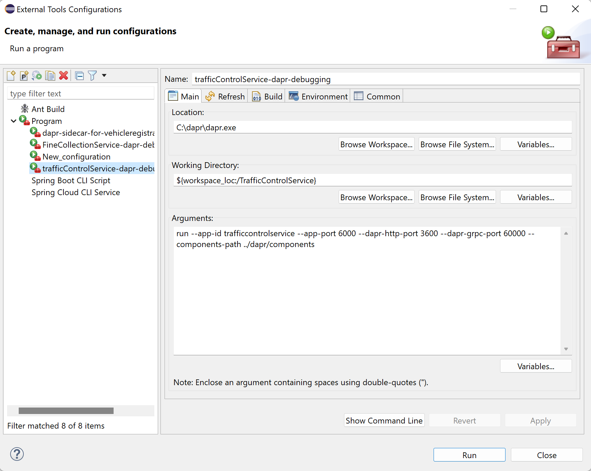

# Assignment 2 - Using Dapr for pub/sub with Kafka

{: .no_toc }

<details open markdown="block">
  <summary>
    Table of contents
  </summary>
  {: .text-delta }
- TOC
{:toc}
</details>

In this assignment, you're going to replace direct Spring Kafka producer and consumer implementation with Dapr **publish/subscribe** messaging to send messages from the TrafficControlService to the FineCollectionService. 

With the Dapr pub/sub building block, you use a *topic* to send and receive messages. The producer sends messages to the topic and one or more consumers subscribe to this topic to receive those messages. First you are going to prepare the TrafficControlService so it can send messages using Dapr pub/sub.

Dapr provides two methods by which you can subscribe to topics:

* **Declaratively**, where subscriptions are defined in an external file.
* **Programmatically**, where subscriptions are defined in user code, using language specific SDK's.

This example demonstrates a **programmatic** approach using Dapr's Java SDK.

If you want to get more detailed information, read the [overview of this building block](https://docs.dapr.io/developing-applications/building-blocks/pubsub/pubsub-overview/) in the Dapr documentation.

To complete this assignment, you must reach the following goals:

1. The TrafficControlService sends `SpeedingViolation` messages using the Dapr pub/sub building block.
2. The FineCollectionService receives `SpeedingViolation` messages using the Dapr pub/sub building block.
3. Kafka is used as pub/sub message broker that runs as part of the solution, either in a Docker container, on directly on laptop.

## Instructions

1. Open the file `dapr/kafka-pubsub.yaml` in your code editor.

1. Inspect this file. As you can see, it specifies the type of the message broker to use (`pubsub.kafka`) and specifies information on how to connect to the Kafka server you started in step 1 (running on localhost on port `9092`) in the `metadata` section.

    ```yaml
    apiVersion: dapr.io/v1alpha1
    kind: Component
    metadata:
      name: pubsub
      namespace: default
    spec:
      type: pubsub.kafka
      version: v1
      metadata:
      - name: brokers # Required. Kafka broker connection setting
        value: "localhost:9092"
      - name: consumerGroup # Optional. Used for input bindings.
        value: "test"
      - name: clientID # Optional. Used as client tracing ID by Kafka brokers.
        value: "my-dapr-app-id"
      - name: authType # Required.
      - name: authRequired
        value: "false"
      - name: maxMessageBytes # Optional.
        value: 1024
      - name: consumeRetryInterval # Optional.
        value: 200ms
      - name: version # Optional.
        value: 0.10.2.0
      - name: disableTls # Optional. Disable TLS. This is not safe for production!! You should read the `Mutual TLS` section for how to use TLS.
        value: "true"
      scopes:
      - trafficcontrolservice
      - finecollectionservice
    ```

    In the `scopes` section, you specify that only the TrafficControlService and FineCollectionService should use the pub/sub building block.

1. **Copy or Move** this file `dapr/kafka-pubsub.yaml` to `dapr/components/` folder (when starting Dapr applications from command line, you specify a folder `dapr/components/` where Dapr component definitions are located). From the root folder, run the following command:

    ```bash
    mkdir dapr/components
    cp dapr/kafka-pubsub.yaml dapr/components/
    ```

## Step 1: Publish messages in the TrafficControlService 

1. Open the file, **TrafficControlService/src/main/java/dapr/traffic/fines/DaprFineCollectionClient.java** in your code editor, and inspect it.

2. It implements the `FineCollectionClient` interface.

    ```java
    public class DaprFineCollectionClient implements FineCollectionClient{
      private final DaprClient daprClient;

      public DaprFineCollectionClient(final DaprClient daprClient) {
        this.daprClient = daprClient;
      }
      
      @Override
      public void submitForFine(SpeedingViolation speedingViolation) {
        
        
        daprClient.publishEvent("pubsub",  "test", speedingViolation).block();
      }

    }
    ```

3. Open the file `TrafficControlService/src/main/java/dapr/traffic/TrafficControlConfiguration.java` in your code editor.

    The default JSON serialization is not suitable for todays goal, so you need to customize the Jackson `ObjectMapper` that it uses. You do so by adding a static inner class to configure the JSON serialization:

    ```java
    static class JsonObjectSerializer extends DefaultObjectSerializer {
        public JsonObjectSerializer() {
            OBJECT_MAPPER.registerModule(new JavaTimeModule());
            OBJECT_MAPPER.configure(SerializationFeature.WRITE_DATES_AS_TIMESTAMPS, false);
        }
    }
    ```

4. **Comment out** following @Bean method:

    ```java
    @Bean
    public FineCollectionClient fineCollectionClient() {
        return new KafkaFineCollectionClient();
    }
    ```

5. **Uncomment** following @Bean method:

    ```java
    //    @Bean
    //    public FineCollectionClient fineCollectionClient(final DaprClient daprClient) {
    //        return new DaprFineCollectionClient(daprClient);
    //    }
    ```

6. **Uncomment** following @Bean method:

    ```java
    //    @Bean
    //    public DaprClient daprClient() {
    //        return new DaprClientBuilder()
    //                .withObjectSerializer(new JsonObjectSerializer())
    //                .build();
    //    }
    ```

7. Check all your code changes are correct by building the code. Execute the following command in the terminal window:

   ```bash
   mvn package
   ```

## Step 2: Receive messages in the FineCollectionService

Dapr will call your service on a `POST` endpoint `/collectfine` to retrieve the subscriptions for that service. You will implement this endpoint and return the subscription for the `test` topic.

1. Open the file `FineCollectionService/src/main/java/dapr/fines/violation/ViolationController.java` in your code editor.

2. Uncomment the code line below:

    ```java
    //@RestController
    ```

3. Uncomment the code snippet below:

    ```java
    // @PostMapping(path = "/collectfine")
    // @Topic(name = "test", pubsubName = "pubsub")
    // public ResponseEntity<Void> registerViolation(@RequestBody final CloudEvent<SpeedingViolation> event) {
    // 	var violation = event.getData();
    // 	violationProcessor.processSpeedingViolation(violation);
    //     return ResponseEntity.ok().build();
    // }
    ```

4. Open the file `FineCollectionService/src/main/java/dapr/fines/violation/KafkaViolationConsumer.java` in your code editor.

5. Comment out @KafkaLister annotation line:

    ```java
    @KafkaListener(topics = "test", groupId = "test", containerFactory = "kafkaListenerContainerFactory")
    ```

6. Check all your code changes are correct by building the code. Execute the following command in the terminal window:

   ```bash
   mvn package
   ```

Now you can test the application.

## Step 3: Test the application

You're going to start all the services now. 

1. Make sure no services from previous tests are running (close the command-shell windows).

1. Open the terminal window and make sure the current folder is `VehicleRegistrationService`.

1. Enter the following command to run the VehicleRegistrationService:

   ```bash
   mvn spring-boot:run
   ```

1. Open a **new** terminal window and change the current folder to `FineCollectionService`.

1. Enter the following command to run the FineCollectionService with a Dapr sidecar:

    Ensure you have run `dapr init` command prior to running the below command.

    ```bash
    dapr run --app-id finecollectionservice --app-port 6001 --dapr-http-port 3601 --dapr-grpc-port 60001 --components-path ../dapr/components mvn spring-boot:run
    ```

1. Open a **new** terminal window and change the current folder to `TrafficControlService`.

1. Enter the following command to run the TrafficControlService with a Dapr sidecar:

    ```bash
    dapr run --app-id trafficcontrolservice --app-port 6000 --dapr-http-port 3600 --dapr-grpc-port 60000 --components-path ../dapr/components mvn spring-boot:run
    ```

1. Open a **new** terminal window and change the current folder to `Simulation`.

1. Start the simulation:

    ```bash
    mvn spring-boot:run
    ```

You should see the same logs as **Assignment 1**. Obviously, the behavior of the application is exactly the same as before.

## Step 4: Debug Dapr applications in Eclipse

The steps below are tailored to debug TrafficControlService, but would be the same for debugging any Dapr application in Eclipse.

1. Click `Run > External Tools > External Tools Configuration..`.
2. Click `New Launch Configuration` icon.
     * Name = trafficcontrolservice-dapr-debug
     * Location = c:\dapr\dapr.exe
     * Working Directory = ${workspace_loc:/TrafficControlService}
     * Arguments = run --app-id finecollectionservice --app-port 6001 --dapr-http-port 3601 --dapr-grpc-port 60001 --components-path ../dapr/components

    

3. Apply.
4. Run.
5. Set breakpoints in your code as you normally would in Eclipse.
6. From `Debug` menu start the application either as a `Java Application` or as a `Spring Boot App`.

<span class="fs-3">
[< Assignment 1 - Run without Dapr]({{ site.baseurl }}){: .btn .mt-7 }
</span>
<span class="fs-3">
[Assignment 3 - Pub/sub with Azure Services >]({{ site.baseurl }}){: .btn .float-right .mt-7 }
</span>
