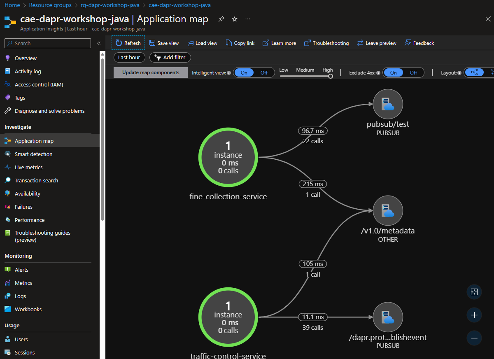

# (Optional) Observability with Dapr using Application Insights

In this section, you will deploy Dapr service-to-service telemetry using Application Insights. When [creating the Azure Container Apps environment](https://learn.microsoft.com/en-us/cli/azure/containerapp/env?view=azure-cli-latest#az-containerapp-env-create), you can set Application Insights instrumentation key that is used by Dapr to export service-to-service telemetry to Application Insights.

## Step 1: Create Application Insights resource

1. Create an Application Insights resource:

    ```bash
    az monitor app-insights component create --app cae-dapr-workshop-java --location eastus --kind web -g rg-dapr-workshop-java --application-type web
    ```

    You may receive a message to install the application-insights extension, if so please install the extension for this exercise.

1. Get the instrumentation key for the Application Insights and set it to the `INSTRUMENTATION_KEY` variable:

    - Linux/Unix shell:

      ```bash
      INSTRUMENTATION_KEY=$(az monitor app-insights component show --app cae-dapr-workshop-java -g rg-dapr-workshop-java --query instrumentationKey)
      echo $INSTRUMENTATION_KEY
      ```

    - PowerShell:

      ```powershell
      $INSTRUMENTATION_KEY = az monitor app-insights component show --app cae-dapr-workshop-java -g rg-dapr-workshop-java --query instrumentationKey
      $INSTRUMENTATION_KEY
      ```

## Step 2: Create Azure Container Apps environment

A [container apps environment](https://learn.microsoft.com/en-us/azure/container-apps/environment) acts as a secure boundary around our container apps. Containers deployed on the same environment use the same virtual network and write the log to the same logging destionation, in our case: Log Analytics workspace.

To create the container apps environment with Dapr service-to-service telemetry, you need to set `--dapr-instrumentation-key` parameter to the Application Insights instrumentation key. Use the following command to create the container apps environment:

```bash
az containerapp env create \
  --resource-group rg-dapr-workshop-java \
  --location eastus \
  --name cae-dapr-workshop-java \
  --logs-workspace-id "$LOG_ANALYTICS_WORKSPACE_CUSTOMER_ID" \
  --logs-workspace-key "$LOG_ANALYTICS_WORKSPACE_CLIENT_SECRET" \
  --dapr-instrumentation-key "$INSTRUMENTATION_KEY"
```

## Step 3: Deploy the application

To deploy the application, follow all the instructions after the creation of the container apps environment in [Deploying Applications to Azure Container Apps (ACA) with Dapr]({{ site.baseurl }}). After the completion of the deployment, you can see the service-to-service telemetry in the Application Insights as shown below.

## Step 4: View the telemetry in Application Insights

1. Open the Application Insights resource in the [Azure portal]([https](https://portal.azure.com/)).

1. Go to `Application Map`, you should see a diagram like the on below


