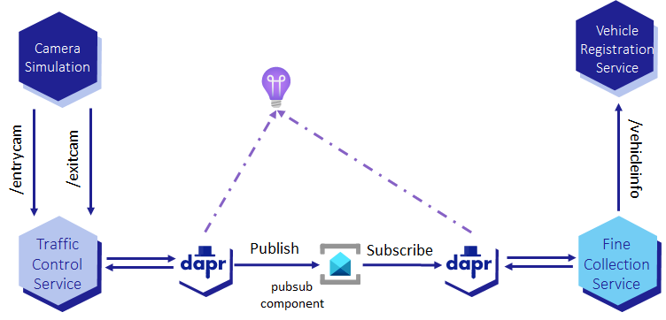

# Assignment 4 - Deploying to Azure Container Apps

{: .no_toc }

  

    Table of contents
  

  {: .text-delta }
- TOC
{:toc}

This assignment is about deploying the 3 microservices to [Azure Container Apps](https://learn.microsoft.com/en-us/azure/container-apps/) with Dapr enabled for pub/sub. This is the first deployment of the microservices to Azure. The next assignments provide step by step instructions for deploying the microservices using more Dapr building blocks. The camera simulation runs locally and is not deployed to Azure.

## Setup



## Step 1 - Deploy Dapr Component for pub/sub

You are going to deploy the `pubsub` Dapr component to use Azure Service Bus as the pub/sub message broker.



<!-- ----------------------- BUILD, DEPLOY AND TEST ------------------------ -->




<!-- ---------------------------- OBSERVABILITY ---------------------------- -->




<!-- ----------------------------- NAVIGATION ------------------------------ -->

[< Assignment 3 - Pub/sub with Azure Service Bus]({{ site.baseurl }}){: .btn .mt-7 }

[Assignment 5 - Service invocation >]({{ site.baseurl }}){: .btn .float-right .mt-7 }
