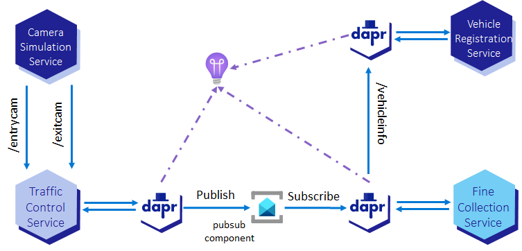

# Assignment 5 - Service Invocation using Dapr

{: .no_toc }

  

    Table of contents
  

  {: .text-delta }
- TOC
{:toc}

This assignment is about using Dapr to invoke the `VehicleRegistrationService` from the `FineCollectionService`. You will use the [service invocation building block](https://docs.dapr.io/developing-applications/building-blocks/service-invocation/service-invocation-overview/) provided by Dapr. This is the second step to reach the final state of the application for this challge. It is represented by the diagram below.

<!-- ------------ STEP 1 - INVOKE VEHICLE REGISTRATION SERVICE ------------- -->




<!-- ---------------------------- DEPLOY TO ACA ---------------------------- -->




<!-- ----------------------------- NAVIGATION ------------------------------ -->

[< Assignment 4 - Deploy to Azure Container Apps]({{ site.baseurl }}){: .btn .mt-7 }

[Assignment 6 - Cosmos DB as a state store >]({{ site.baseurl }}){: .btn .float-right .mt-7 }

