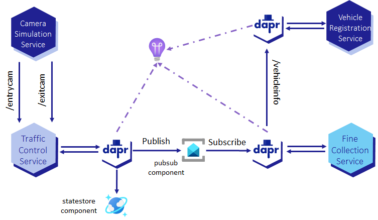

# Assignment 6 - Using Azure Cosmos DB as a state store

{: .no_toc }

<details open markdown="block">
  <summary>
    Table of contents
  </summary>
  {: .text-delta }
- TOC
{:toc}
</details>

This assignment is about using Azure Cosmos DB as a [state store](https://docs.dapr.io/operations/components/setup-state-store/) for the `TrafficControlService` instead of keeping the sate in memory. You will use the [Azure Cosmos DB state store component](https://docs.dapr.io/reference/components-reference/supported-state-stores/setup-azure-cosmosdb/) provided by Dapr. This is the third step to reach the final state of the application for this challenge. It is represented by the diagram below.



## Step 1: Create an Azure Cosmos DB



## Step 2: Deploy Azure Cosmos DB state store component to ACA

1. Open the file `dapr/aca-azure-cosmosdb-statestore.yaml` in your code editor and look at the content of the file.

1. **Copy or Move** this file `dapr/aca-azure-cosmosdb-statestore.yaml` to `dapr/components` folder.

1. **Replace** the following placeholders in this file `dapr/components/aca-azure-cosmosdb-statestore.yaml` with the values you noted down in the previous step:

    - `<YOUR_COSMOSDB_ACCOUNT_URL>` with the Cosmos DB account URL
    - `<YOUR_COSMOSDB_MASTER_KEY>` with the master key

1. Go to the root folder of the repository.

1. Enter the following command to deploy the `statestore` Dapr component:

    ```bash
    az containerapp env dapr-component set \
      --name cae-dapr-workshop-java \
      --resource-group rg-dapr-workshop-java \
      --dapr-component-name statestore \
      --yaml ./dapr/components/aca-azure-cosmosdb-statestore.yaml
    ```

## Step 3: Add the Azure Cosmos DB state store to the `TrafficControlService`



<!-- ----------------------- BUILD, DEPLOY AND TEST ------------------------ -->




<!-- ----------------------------- NAVIGATION ------------------------------ -->

<span class="fs-3">
[< Assignment 5 - Service invocation]({{ site.baseurl }}){: .btn .mt-7 }
</span>
<span class="fs-3">
[Assignment 5 - Service invocation >]({{ site.baseurl }}){: .btn .float-right .mt-7 }
</span>