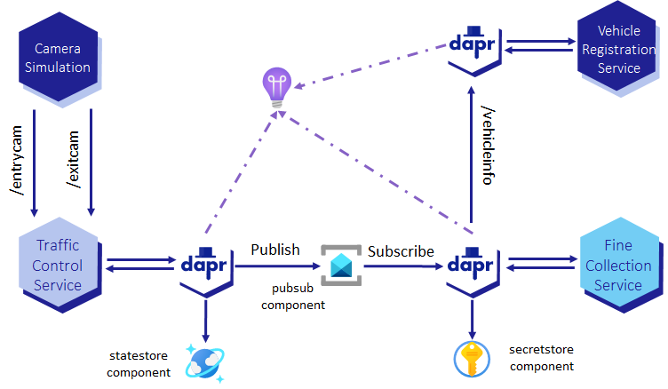

# Assignment 8 - Managed Identities

{: .no_toc }

  

    Table of contents
  

  {: .text-delta }
- TOC
{:toc}

<!-- -------------------------------- INTRO -------------------------------- -->



This is the fifth step to reach the final state of the application for this challenge. It is represented in the diagram below.

<!-- --------------------- DEPLOY, TEST AND DISCUSSION ---------------------- -->



<!-- ----------------------------- NAVIGATION ------------------------------ -->

[< Reference a secret in Dapr components]({{ site.baseurl }}){: .btn .mt-7 }

[Assignment 9 - Scaling >]({{ site.baseurl }}){: .btn .float-right .mt-7 }

