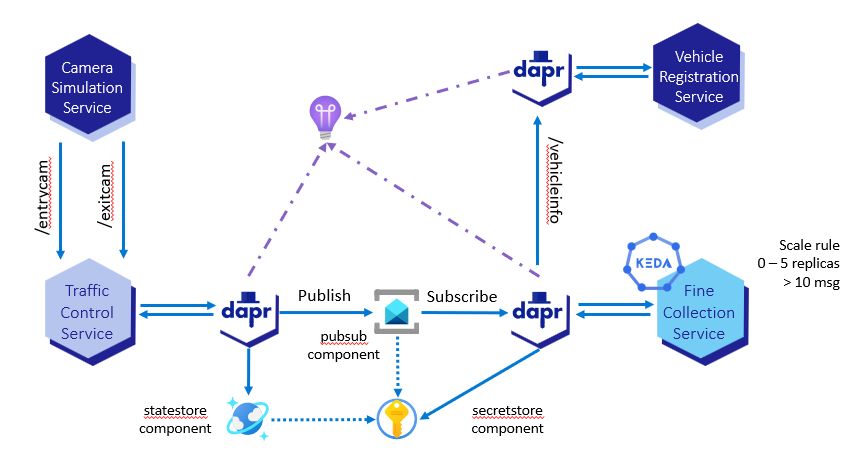
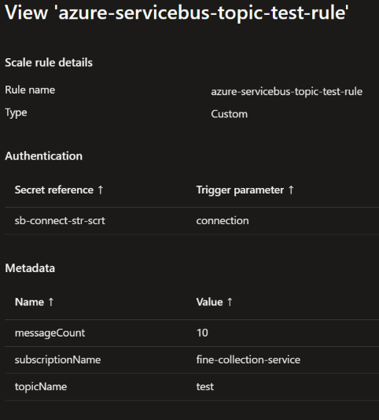
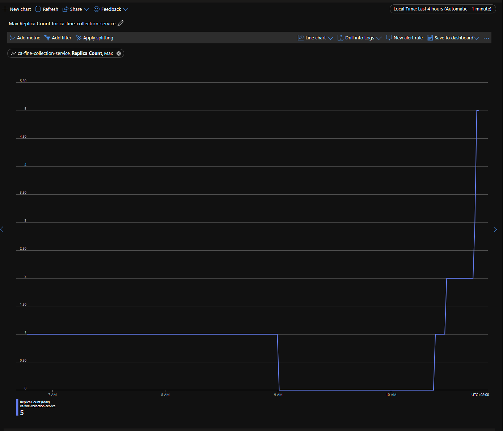

# Assignment 8 - Scaling in Azure Container Apps

{: .no_toc }

<details open markdown="block">
  <summary>
    Table of contents
  </summary>
  {: .text-delta }
- TOC
{:toc}
</details>

Fine collection service is a stateless service that could be subject of peaks of request. To ensure that the service can handle the load, it is important to scale the service out to multiple instances when needed. Container Apps can scale up to [300 replicas per revision](https://learn.microsoft.com/en-us/azure/container-apps/scale-app?pivots=azure-cli#scale-definition). For example, if there is an increase in the traffic during the day, the probability of having more speed violation could be higher, the amount of messages in the topic could increase and the service could be subject of peaks of request. In this case, the service should be scaled out to multiple instances to handle the load.

On an other hand, the service is not used all the time. For example, during the night, there could be less traffic and the service could not be used. If there is no message in the topic (i.e. no speed violation), the service can be scaled to zero replicas to save cost. Indeed if a container app has zero replicas, [no resource consumption charges are incurred](https://learn.microsoft.com/en-us/azure/container-apps/billing#no-replicas-are-running) for this application (if and only if the container app is deploy to a consumption workload).

In this assignment, you are going to [scale](https://learn.microsoft.com/en-us/azure/container-apps/scale-app?pivots=azure-cli#custom) fine collection service from 0 to 5 replicas, i.e. to define a scaling rule for `ca-fine-collection-service` container apps. To do so, you are going to use [KEDA](https://keda.sh/) that is supported out of the box by Azure Container Apps. This open source project can drove the scaling of any container in Azure Container Apps based on the nummber of events needing to be processed. For fine collection service, [Azure Service Bus scaler](https://keda.sh/docs/2.11/scalers/azure-service-bus/) is used. It scales the container app replicas based on the number of messages on a topic or a queue.

This is the last step of the challenge. At the end of this assignment you should have the final state of the architecture as shown in the following diagram:



## Step 1: Set the authentication

To be able to determine the number of messages on the `test` topic, KEDA needs to be able to connect to the service bus. To do so, you need to create a secret in `ca-fine-colelction-service` container app. Currently [scale rules of Container Apps support only secret references](https://learn.microsoft.com/en-us/azure/container-apps/scale-app?pivots=azure-cli#authentication-1).

To create a secret for service bus connection string, enter the following command in the terminal:

```bash
az containerapp secret set \
  --name ca-fine-collection-service \
  --resource-group rg-dapr-workshop-java \
  --secrets "sb-connect-str-scrt=<service-bus-connection-string>"
```

Where `<service-bus-connection-string>`  should be replaced by the connection string of the service bus.

{: .note }
> The length of the secret name is limited to 20 characters when set using Azure CLI. Using the portal or a Bicep template, you can use longer secret names and therefore more meaningfull names.
> 

## Step 2: Set the scale rule

To set the scale rule, enter the following command:

```bash
az containerapp update \
  --name ca-fine-collection-service \
  --resource-group rg-dapr-workshop-java \
  --min-replicas 0 \
  --max-replicas 5 \
  --scale-rule-name azure-servicebus-topic-test-rule \
  --scale-rule-type azure-servicebus \
  --scale-rule-metadata "subscriptionName=fine-collection-service" \
                        "topicName=test" \
                        "messageCount=10" \
  --scale-rule-auth "connection=sb-connect-str-scrt"
```

This command creates a scale rule named `azure-servicebus-topic-test-rule` for `ca-fine-collection-service` container app. The rule is based on the number of messages on the `test` topic of the `fine-collection-service` subscription. The rule is triggered when there are 10 messages on the topic. The connection string of the service bus is stored in the secret named `sb-connect-str-scrt`. The minimum number of replicas is set to 0 and the maximum number of replicas is set to 5.

You can now go to the portal and check that the scale rule has been created. To do so, go to the `ca-fine-collection-service` container app and click on the `Scale and replicas` in `Application` section. You should see the following:



You can also check that the scale rule has been created by entering the following command in the terminal:

```bash
az containerapp show \
  --name ca-fine-collection-service \
  --resource-group rg-dapr-workshop-java \
  --query "properties.template.scale" \
  -o json
```

## Step 3: Test the scaling

1. If the simulation is running, stop the simulation.

1. After a few minutes, you should see that the number of replicas has decreased to zero.

1. Check the list of replicas using the following command:

    ```bash
    az containerapp replica list \
      --name ca-fine-collection-service \
      --resource-group rg-dapr-workshop-java
    ```

    If there is no replica, the answer should be:

    ```json
    []
    ```

1. When the number of replicas is zero, start the simulation again.

    1. Set the following environment variable:
   
        - Linux/Unix shell:

            ```bash
            export TRAFFIC_CONTROL_SERVICE_BASE_URL=https://$TRAFFIC_CONTROL_SERVICE_FQDN
            ```

        - PowerShell:

            ```powershell
            $env:TRAFFIC_CONTROL_SERVICE_BASE_URL = "https://$TRAFFIC_CONTROL_SERVICE_FQDN"
            ```

    1. In the root folder of the simulation (`Simulation`), enter the following command:

        ```bash
        mvn spring-boot:run
        ```

1. After a few minutes, you should see that the number of replicas has increased.

    ```bash
    az containerapp replica list \
      --name ca-fine-collection-service \
      --resource-group rg-dapr-workshop-java \
      --query "[].name" \
      -o json
    ```

### Increase the number of messages

To increase the number of messages on the topic, you can either:

- Run multiple simulation in parallel.
- Send batch of messages to the topic using the [Azure portal](https://portal.azure.com).

To send batch of messages using the portal, follow these steps:

1. Go to the service bus `sb-dapr-workshop-java-...` in the portal.

1. Select the `Topics` in the `Entities` section.

1. Select the `test` topic.

1. Select the `Service Bus Explorer`

1. Click on `Send messages`

1. Select `Content type`: `application/json`

1. Paste the following JSON in the `Message Body`

    ```json
    {
      "data": {
        "excessSpeed": 45,
        "licenseNumber": "9-HGN-5",
        "roadId": "A12",
        "timestamp": "2023-08-04T17:47:48.1267658"
      },
      "datacontenttype": "application/json",
      "id": "67c0e273-5536-404d-b43b-8f839739f12f",
      "pubsubname": "pubsub",
      "source": "traffic-control-service",
      "specversion": "1.0",
      "time": "2023-08-04T15:47:48Z",
      "topic": "test",
      "traceid": "00-c698158cb6e49814d850311642b85c2e-d979c6869ccd347a-01",
      "traceparent": "00-c698158cb6e49814d850311642b85c2e-d979c6869ccd347a-01",
      "tracestate": "",
      "type": "com.dapr.event.sent"
    }
    ```

1. In the bottom, check `Repeat send` and set `Number of messages` to `10000`.

1. Click on `Send`

If the amount of replicas does not increased, you can wait a few minutes or send more messages.

### Check the replica count in the portal

`Replica Count` is a metric that is available in the portal. To check the replica count, follow these steps:

1. Go to the `ca-fine-collection-service` container app in the portal.

1. Select `Metrics` in the `Monitoring` section.

1. Select `Replica Count` in the `Metric` dropdown.

1. Select `1h` in the `Time range` dropdown.

You should see something like this:



## Next Steps

Well done! You have successfully completed the challenge.

As next steps, you can:

- Explore [Azure Container Apps documentation](https://docs.microsoft.com/en-us/azure/container-apps/). There are many other features that you can use like jobs, private networks, etc. Some of these features are still in preview.
- Look at the [ACA Landing Zone Accelerator](https://github.com/Azure/ACA-Landing-Zone-Accelerator) and how to deploy a secure baseline with an internal environment.
  - The application of this workshop is used by the landing zone accelerator to demonstrate the [deployment of microservices in Azure Container Apps](https://github.com/Azure/aca-landing-zone-accelerator/tree/main/scenarios/aca-internal/bicep/sample-apps/java-fine-collection-service). It uses User Managed Identity to access Azure resources: Service Bus, Cosmos DB and Key Vault.
  - The sample app images used are based on the [end-to-end flow branch](https://github.com/Azure/java-aks-aca-dapr-workshop/tree/e2e-flow) that can be used to check your solutions for the workshop.
- Contribute to this workshop by adding new challenges or improving the existing ones.

{: .important-title }
> Cleanup
>
> When the workshop is done, please follow the [cleanup instructions]({{ site.baseurl }}) to delete the resources created in this workshop.
>
