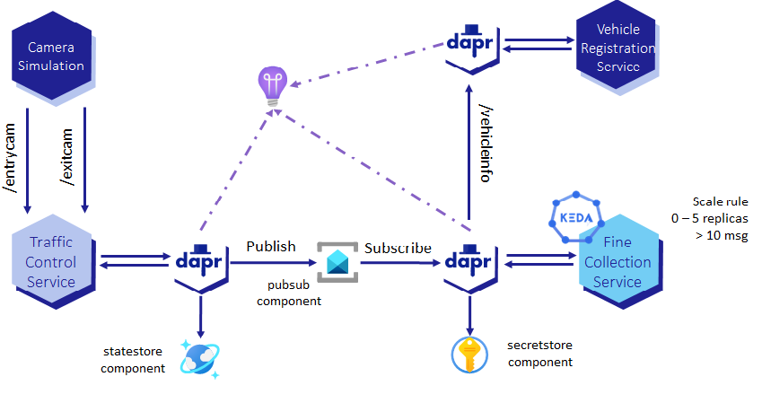

# Assignment 9 - Scaling Fine Collection Service in Azure Container Apps

{: .no_toc }

  

    Table of contents
  

  {: .text-delta }
- TOC
{:toc}

<!-- -------------------------------- INTRO -------------------------------- -->



This is the last step of the challenge. At the end of this assignment you should have the final state of the architecture as shown in the following diagram:

<!-- --------------------------- DEPLOY AND TEST --------------------------- -->



<!-- ----------------------------- NEXT STEPS ------------------------------ -->

## Next Steps

Well done, you have successfully completed the workshop!

As next steps, you can:

- Explore [Azure Container Apps documentation](https://docs.microsoft.com/en-us/azure/container-apps/). There are many other features that you can use like jobs, private networks, etc. Some of these features are still in preview.
- Look at the [ACA Landing Zone Accelerator](https://github.com/Azure/ACA-Landing-Zone-Accelerator) and how to deploy a secure baseline with an internal environment.
  - The application of this workshop is used by the landing zone accelerator to demonstrate the [deployment of microservices in Azure Container Apps](https://github.com/Azure/aca-landing-zone-accelerator/tree/main/scenarios/aca-internal/bicep/sample-apps/java-fine-collection-service). It uses User Managed Identity to access Azure resources: Service Bus, Cosmos DB and Key Vault.
  - The sample app images used are based on the [end-to-end flow branch](https://github.com/Azure/java-aks-aca-dapr-workshop/tree/e2e-flow) that can be used to check your solutions for the workshop.
- Contribute to this workshop by adding new challenges or improving the existing ones.

<!-- ------------------------------- CLEANUP ------------------------------- -->

{: .important-title }
> Cleanup
>
> When the workshop is done, please follow the [cleanup instructions]({{ site.baseurl }}) to delete the resources created in this workshop.
>

<!-- ----------------------------- NAVIGATION ------------------------------ -->

[< Assignment 8 - Managed Identities]({{ site.baseurl }}){: .btn .mt-7 }

