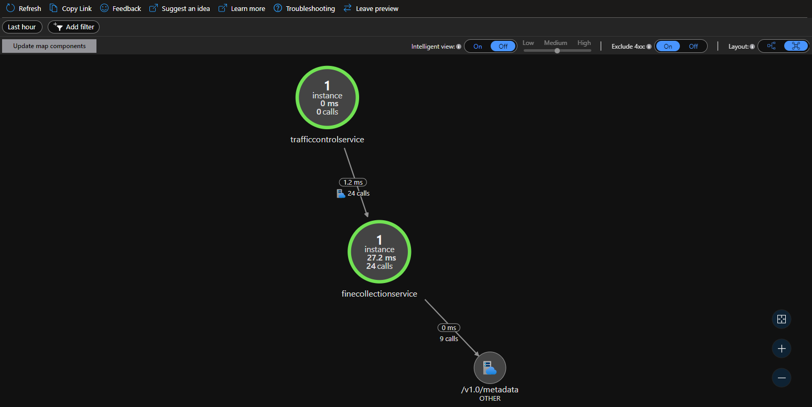

# Assignment 6 - Observability with Dapr using OpenTelemetry

In this section, you will deploy the [OpenTelemetry Collector](https://github.com/open-telemetry/opentelemetry-collector) to our new AKS cluster and configure Dapr to send telemetry to the vendor agnostic collector implementation. The collector will be configured to send telemetry to an Application Insights resource that we will create within our existing Azure resource group.

## Step 1: Create Application Insights resource

Run the following Azure CLI command to create the Application Insights resource in Azure.

```azure cli
az monitor app-insights component create --app dapr-workshop-java-aks --location eastus --kind web -g dapr-workshop-java --application-type web
```

> You may receive a message to install the application-insights extension, if so please install the extension for this exercise.

After the command completes, the output from the command will contain a property called "instrumentationKey" that will contain a unique identifier you will need to copy and save for later.

## Step 2: Configure OpenTelemetry Collector

Open the file called `open-telemetry-collector-appinsights.yaml` that's located within the deploy folder.

Next, find the Instrumentation Key value you copied from the previous step and replace the `<INSTRUMENTATION-KEY>` placeholder with this value and save.

Apply this configuration to your AKS cluster using the following command

```console
kubectl apply -f deploy/open-telemetry-collector-appinsights.yaml
```

## Step 3: Configure Dapr to send tracing to OpenTelemetry Collector

Next, we need to configure Dapr to send tracing information to our newly deployed OpenTelemetry Collector using the following configuration file.

Open the file called `collector-config.yaml` within the deploy folder and inspect the configuration.  This file will instruct Dapr to send telemetry data to the `otel-collector` endpoint for distribution to all registered telemetry stores, in our case it'll be Azure Application Insights.

```yaml
apiVersion: dapr.io/v1alpha1
kind: Configuration
metadata:
  name: appconfig
  namespace: default
spec:
  tracing:
    samplingRate: "1"
    zipkin:
      endpointAddress: "http://otel-collector.default.svc.cluster.local:9411/api/v2/spans"
```

Apply this configuration to your AKS cluster using the following command

```console
kubectl apply -f collector-config.yaml
```

## Step 4: Configure Java Deployments to use Dapr

The Java deployments that are currently running in AKS need to be configured to use the new `appConfig` configuration that was just applied.

Add the following annotation `dapr.io/config: "appconfig"` to each of the java deployments that will be participating sending tracing telemetry to the OpenTelemetry Collector endpoint.

### TrafficControlService

Find the `trafficcontrolservice-deployment.yaml file created in the previous assignment and make sure the annotations look like below.

```yaml
apiVersion: apps/v1
kind: Deployment
metadata:
  ...
spec:
  ...
  template:
    metadata:
      ...
      annotations:
        dapr.io/enabled: "true"
        dapr.io/app-id: "trafficcontrolservice"
        dapr.io/app-port: "6000"
        dapr.io/config: "appconfig"
```

### FineCollectionService

Find the `finecollectionservice-deployment.yaml file created in the previous assignment and make sure the annotations look like below.

```yaml
apiVersion: apps/v1
kind: Deployment
metadata:
  ...
spec:
  ...
  template:
    metadata:
      ...
      annotations:
        dapr.io/enabled: "true"
        dapr.io/app-id: "finecollectionservice"
        dapr.io/app-port: "6001"
        dapr.io/config: "appconfig"
```

Apply these two configurations to AKS using the following two commands.

```console
kubectl apply -f deploy/trafficcontrolservice-deployment.yaml
```

```console
kubectl apply -f deploy/finecollectionservice-deployment.yaml
```

## Step 5: Verify telemetry in Application Insights

Open the Azure Portal and navigate to the Application Insights resource within your resource group.

Open the Application Insights blade and click on the `Search` button in the navigation and run query.

If configured correctly, tracing data should show up in the search results.

Find the Application Map feature within the lefthand navigation of the Application Insights blade and click to show the mapping of telemetry calls between services.

